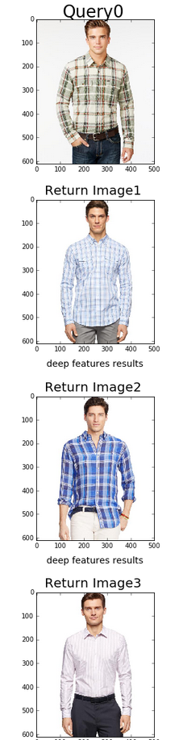
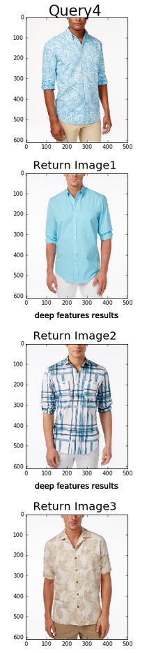
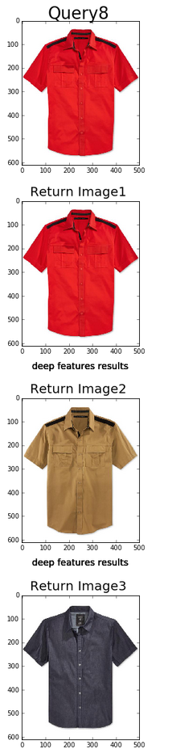
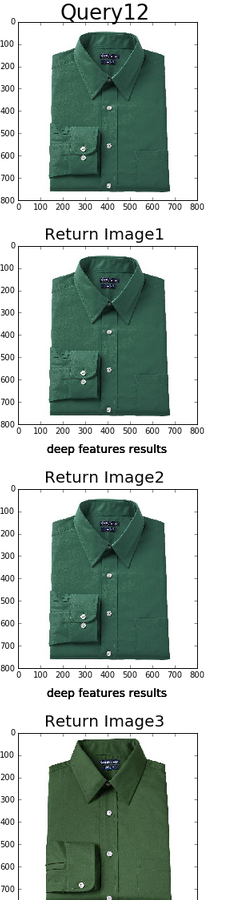
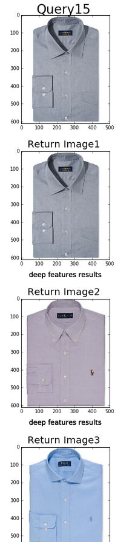

# visual-similarity

Code and results from the visual similarity exercise.

This repo contains Source/visualSimilarity.ipynb, which uses a deep convolutional neural network to extract deep features from the query images, and a k-nearest neighbors classifier to find the most visually similar images to a given query.

Results contains the test and returned images for the various pipelines. Results contains subfolders DeepFeats256, DeepFeats16 and Pixels, which contains the results from the deep feature classifers with 256 filters, 16 filters and the classifer on pixel space respectively. Query image n is at nquery_image.png, with its top kth visually similar images at nreturn_imagek.png. For example 17query_image.png is the 17th query image, and the returned images are at 17return_image1.png, 17return_image2.png, and so on. 

Some sample results from our deepFeats256 pipeline:

and from our pixel space pipeline:

Date: Aug 4, 2016
Author: Adam Lesnikowski
Edited Aug 5, 2016

