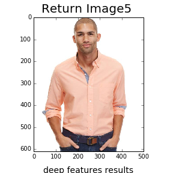
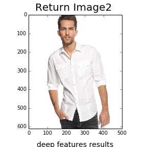
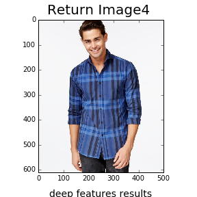
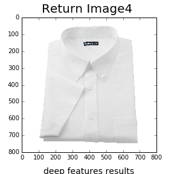

# visual-similarity

Code and results from our visual similarity exercise.

This repo contains [our Jupyter notebook](Source/visualSimilarity.ipynb), which uses a deep convolutional neural network to extract deep features from the query images, and a k-nearest neighbors classifier to find the most visually similar images to a given query.
Results/ contains the test and returned images for the various pipelines, with subfolders DeepFeats256/, DeepFeats16/ and Pixels/, which contain the results from the deep feature classifers with 256 filters, 16 filters and the classifer on pixel space respectively. Query image n is at nquery_image.png, with its top kth visually similar images at nreturn_imagek.png. For example 17query_image.png is the 17th query image, and the returned images are at 17return_image1.png, 17return_image2.png, and so on. 

## Results

### Neural Codes

Here are the first four queries and results from our **deepFeats256** pipeline using 256 filters from a deep neural network, **L2** metric:

### **L1** and **Linf** metrics:
**deepFeats256** pipeline with nearest neighbors according to the **L1** taxicab metric:

**deepFeats256** pipeline with the Chebyshev **Linf** or maximum metric:

### Pixel Space Baseline
Versus our **pixel space baseline** search:

Date: Aug 4, 2016
Author: Adam Lesnikowski
Edited Aug 5, 2016, Aug 12, 2016.

### Further directions:

* Compare results with a a normalized nearest neighbor approach, i.e. cosine similarity metric.
* Plot on 2 dimensions using t-distributed stochastic neighbor embedding (t-sne) or similar dimension reduction technique. 

